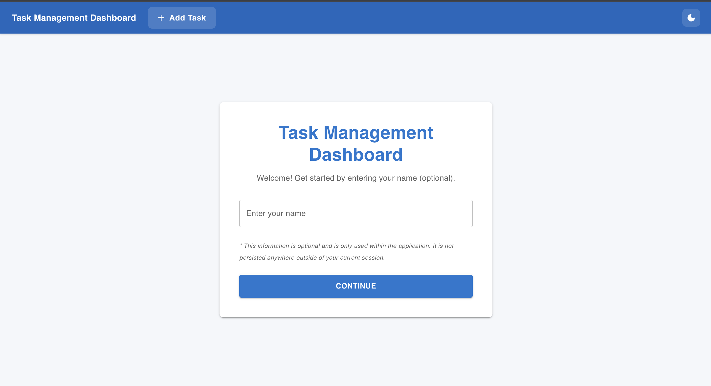
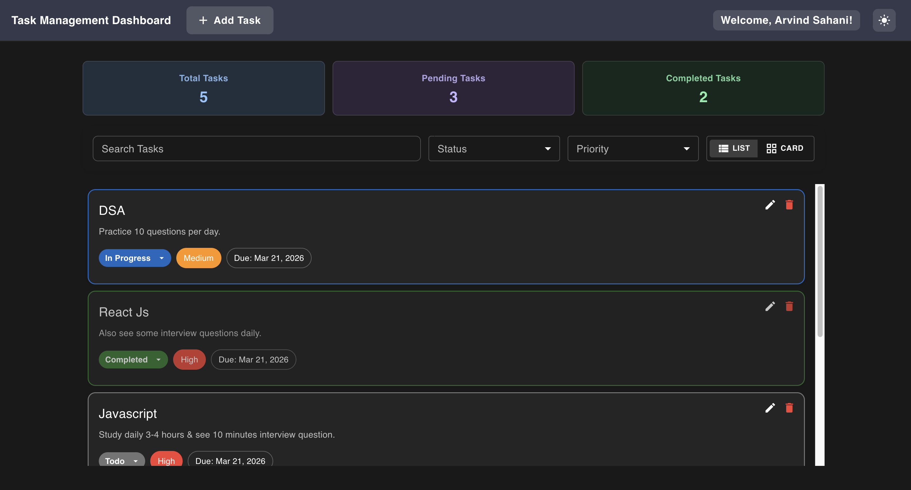
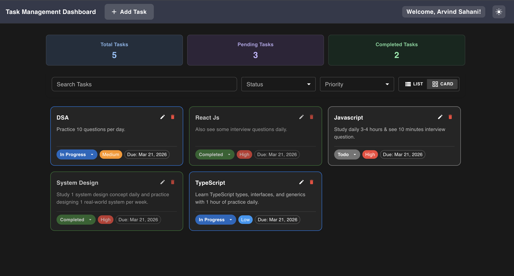
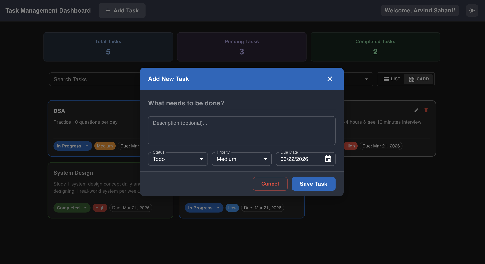
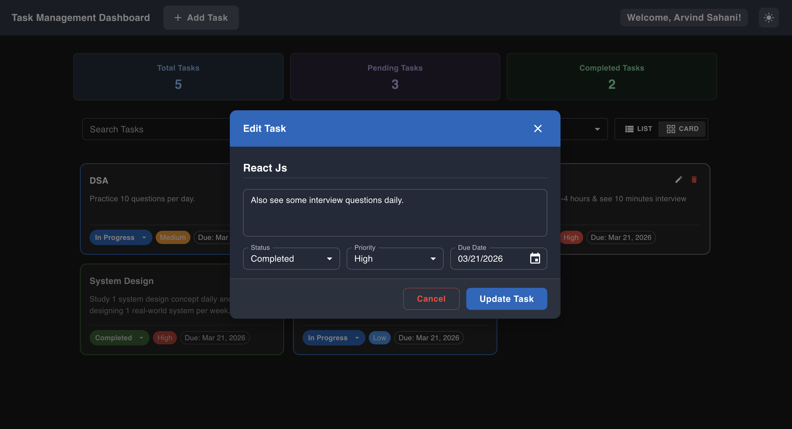
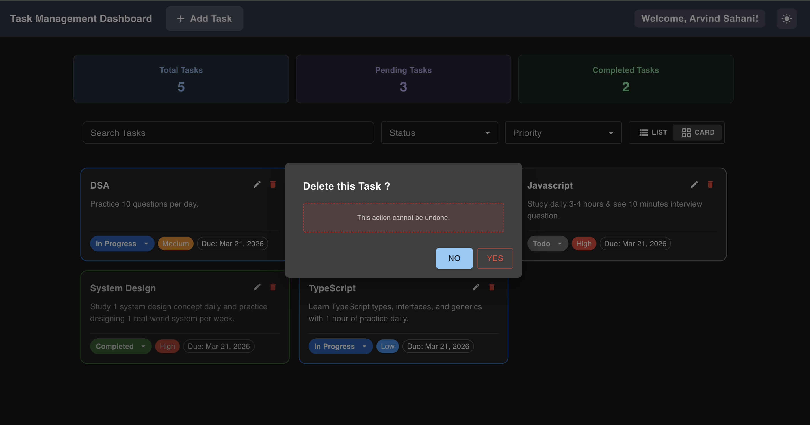

# Task Management Dashboard

A responsive, feature-rich **Task Management Dashboard** built with **React 19** and **TypeScript**. It supports full CRUD operations, real-time search and multi-filter, dual view modes (List & Grid), dark/light theme toggle, and data persistence via `localStorage` — entirely frontend with no backend required.

---

## 🚀 Live Demo

> **[👉 Click here to view the Live Demo](https://your-deployment-url.netlify.app)**
>
> *(Replace this link with your Netlify / Vercel deployment URL)*

---

## Project Overview (Screenshots)

### 🏠 Landing Page - (Light Mode)


### 📋 Dashboard — List View (Dark Mode)


### 🔲 Dashboard — Card / Grid View (Dark Mode)


### ➕ Add New Task (Dark Mode)


### ✏️ Edit Task (Dark Mode)


### 🗑️ Delete Confirmation (Dark Mode)


---

## Features

### 1) Landing Page ( 🎁 Bonus Feature )

- A clean welcome screen that greets the user.
- User can optionally enter their **name**, which is stored in `sessionStorage` and displayed in the header as a personalized greeting (e.g., "Welcome, Arvind").
- Clicking **"Get Started"** navigates to the Task Dashboard.

---

### 2) Task Dashboard

**Summary Stats ( 🎁 Bonus Feature ):**
- Displays **3 stat cards** at the top — **Total Tasks**, **Pending Tasks**, and **Completed Tasks**.
- Stats update in real time as tasks are added, edited, or deleted.

**Add Task:**
- Click the **"Add Task"** button in the header to open a modal dialog.
- Form fields:
  - **Title** *(required)*
  - **Description** *(optional)*
  - **Status** — `Todo` / `In Progress` / `Completed`
  - **Priority** — `Low` / `Medium` / `High`
  - **Due Date** — Date picker (minimum date is today for new tasks)
- Validation is powered by **Yup** schema + **react-hook-form**.
- Default values: Status → `Todo`, Priority → `Medium`, Due Date → 7 days from today.

**Edit Task:**
- Each task card has an **Edit** button.
- Opens the same form pre-filled with existing task data.
- Click **"Update Task"** to save changes.

**Delete Task:**
- Each task card has a **Delete** button.
- A **Confirmation Dialog** appears before deletion to prevent accidents.

**Quick Status Update:**
- Each task card has an inline **Status dropdown** — change status directly without opening the edit dialog.

---

### 3) Search & Filtering

**Real-time Search:**
- Search by task **title or description** with a **300ms debounce** to avoid excessive re-renders.

**Filter by Status:**
- Multi-select dropdown — filter tasks by one or multiple statuses at the same time (e.g., show only `Todo` + `In Progress`).

**Filter by Priority:**
- Multi-select dropdown — filter tasks by one or multiple priorities simultaneously.

**Sort Order:**
- Tasks are always sorted **newest first** by creation date.

**Filter Persistence ( 🎁 Bonus Feature ):**
- Active filters and search query are saved to `localStorage` and restored on next visit.

---

### 4) List View & Grid View ( 🎁 Bonus Feature )

Toggle between two display modes:

- **List View** — Virtualized using `react-window`'s `FixedSizeList` for smooth performance even with hundreds of tasks.
- **Grid View** — Responsive CSS grid (1 column on mobile, 2 on tablet, 3 on desktop).

Each task card displays:
- Title, description (truncated), status badge (with color), priority chip (with color), due date chip
- **Overdue tasks** are highlighted with a red due date chip.

---

### 5) Dark / Light Theme ( 🎁 Bonus Feature )

- Toggle between **Dark Mode** and **Light Mode** via the icon in the app header.
- Theme preference is persisted in `localStorage` via Zustand's `persist` middleware.

---

### 6) Data Persistence & Demo Tasks

- All tasks are automatically saved to **`localStorage`** — data survives page refreshes and browser restarts.
- **5 pre-loaded demo tasks** are shown on first visit so the dashboard isn't empty.

---

### 7) Responsive Design

- Fully responsive across **mobile (320px+), tablet, and desktop** screen sizes.
- Built using Material UI's responsive `sx` props, breakpoints, and `useMediaQuery`.

---

### 8) TypeScript ( 🎁 Bonus Feature )

- Entire codebase written in **TypeScript** — strict type safety across components, stores, utilities, and validation schemas.
- Custom interfaces and types defined for all data structures (`Task`, `TaskFormData`, `FilterState`, etc.).

---

## Tech Stack

| Category | Technology | Version |
|---|---|---|
| Framework | React + TypeScript | 19.x / 5.9.x |
| Build Tool | Vite | 7.x |
| UI Library | Material UI (MUI) | 7.x |
| State Management | Zustand (with persist) | 5.x |
| Routing | React Router DOM | 7.x |
| Forms | react-hook-form + Yup | 7.x / 1.x |
| Date Handling | Day.js + MUI X Date Pickers | 1.x / 7.x |
| Virtualized List | react-window | 1.x |
| Linting | ESLint + plugins | 8.x |
| Formatting | Prettier | 3.x |

---

## Project Structure

```
src/
├── app/
│   ├── App.tsx                  # Root component (ThemeProvider, Router)
│   └── router.tsx               # Route definitions (/ and /dashboard)
├── constants/
│   └── task.ts                  # Statuses, priorities, DEMO_TASKS, storage keys
├── features/
│   ├── landing/
│   │   └── pages/
│   │       └── LandingPage.tsx  # Welcome / username entry page
│   └── task/
│       ├── components/
│       │   ├── TaskCard.tsx     # Task card (list & grid variants)
│       │   ├── TaskForm.tsx     # Add / Edit task form
│       │   └── TaskList.tsx     # Search, filters, virtualized list, grid view
│       ├── pages/
│       │   └── TaskDashboard.tsx  # Stat cards + TaskList + Add Task dialog
│       ├── store/
│       │   └── taskStore.ts     # Zustand store — CRUD + localStorage
│       └── types/
│           ├── types.ts         # Core TypeScript interfaces & types
│           └── validation.ts    # Yup schema for task form
├── shared/
│   ├── components/
│   │   ├── AppHeader.tsx        # App bar with Add Task, username, theme toggle
│   │   ├── AppLayout.tsx        # Layout wrapper (AppHeader + Outlet)
│   │   └── ConfirmationDialog.tsx  # Reusable delete-confirm dialog
│   ├── store/
│   │   └── themeStore.ts        # Zustand theme store (dark/light + persist)
│   └── types/
│       ├── dialogTypes.ts       # ConfirmationDialog prop types
│       └── storeTypes.ts        # ThemeMode + ThemeState types
├── styles/
│   └── index.css                # Global reset (box-sizing, margin, font-family)
├── utils/
│   ├── formatter.ts             # kebabToTitleCase(), formatDate()
│   ├── storage.ts               # localStorage / sessionStorage wrappers
│   └── task.ts                  # filterTasksByStatus(), searchTasks(), filterByPriority()
└── external-modules.d.ts        # Module declaration for react-window
```

---

## Setup and Running Instructions Locally

### Prerequisites

- **Node.js**: v18 or higher
- **Yarn**: Package manager
- If not then install ```yarn package manager``` using below command through your terminal
```sh
npm install -g yarn
```

### Installation

1. Clone the repository:

```sh
git clone https://github.com/arvindk2025/Task-Management-Dashboard.git
cd Task-Management-Dashboard
```

2. Install dependencies:
```sh
yarn install
```

3. Start the development server:
```sh
yarn dev
```

The application will be available at `http://localhost:5173`

---

